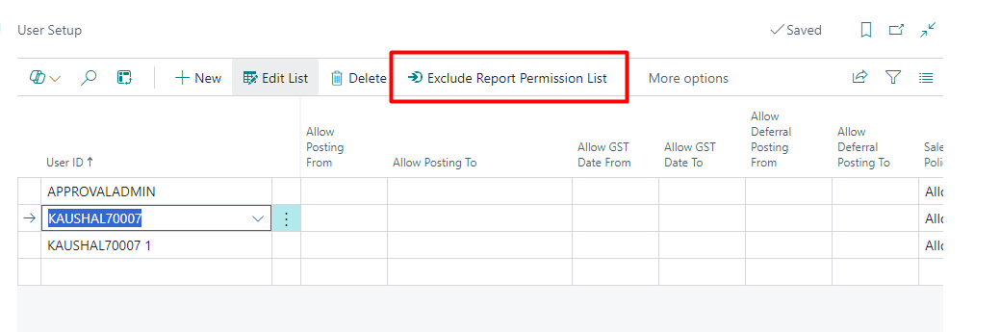
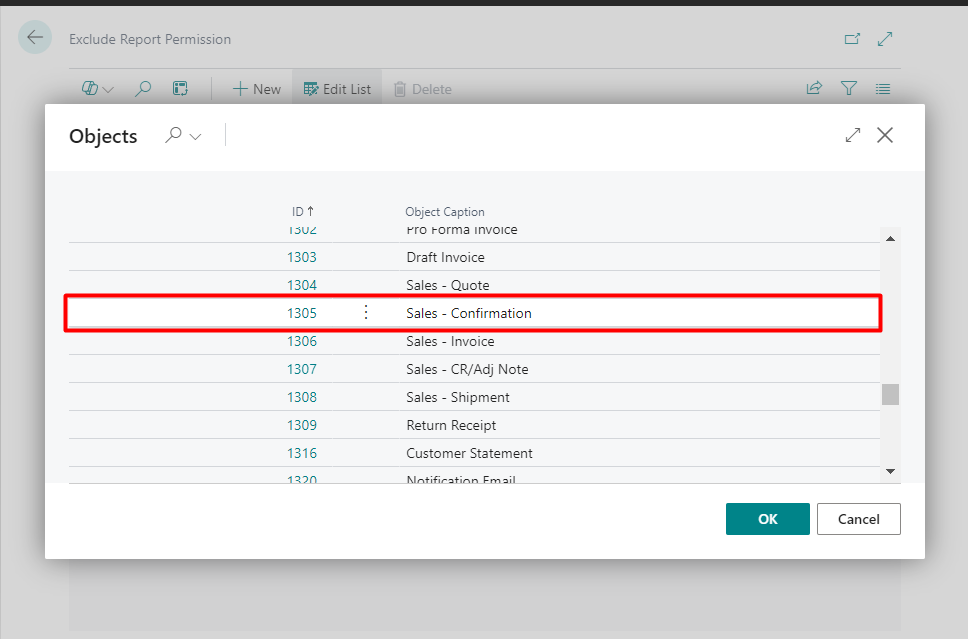
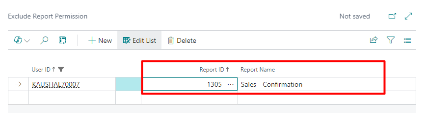
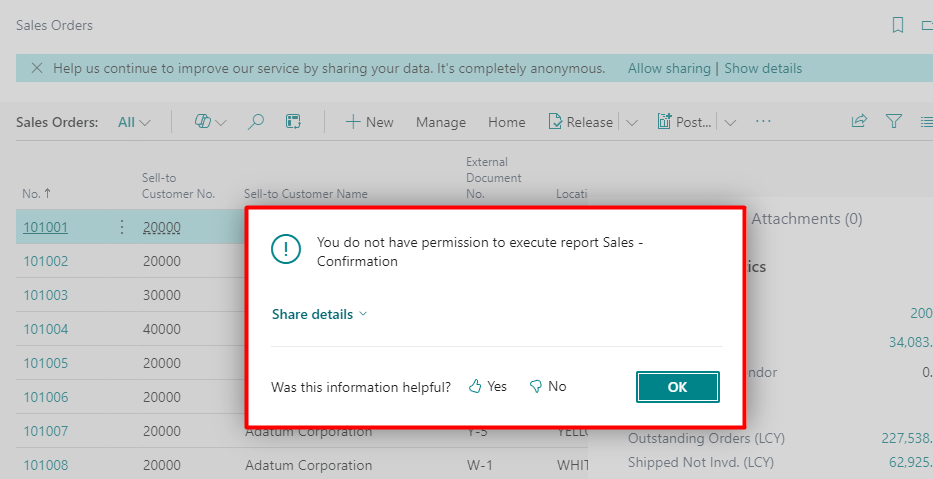

1. Go to User setup
2. Select user and click on "Exclude report Permission List"

3. From the lookup select the report for which access to be restricted.

4. If user will try to execute that report system will stop.
